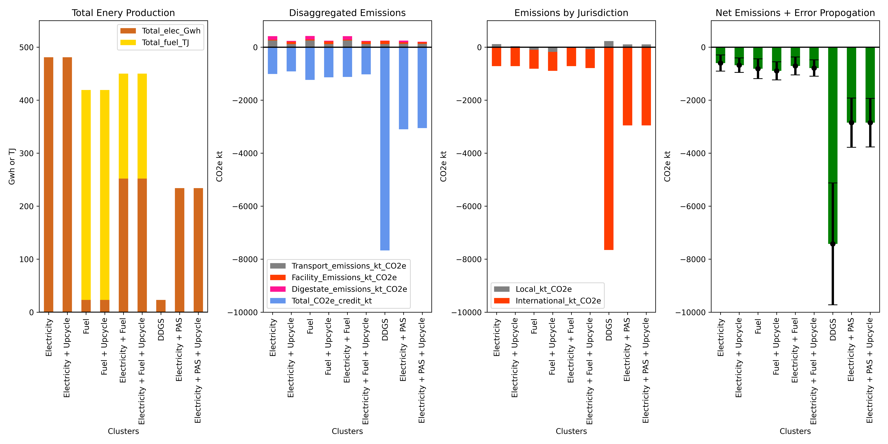

The Intergovernmental Panel on Climate Change (IPCC) has issued stark warnings that our world is rapidly approaching "irreversible" levels of global heating, which will have catastrophic impacts. Worse still, this scenario is quickly approaching inevitability, and it is “now or never” in terms of taking meaningful, dramatic, and drastic measures to avoid a climate breakdown.

The scale of the issue is massive; as such, it is crucial that we achieve global net-zero emissions as soon as possible to avoid the most severe impacts wrought by climate breakdown. Scotland is one of over 100 countries that have committed to, or are considering, net-zero emissions targets. Increasing bio-energy production is a key aim in Scotland’s net-zero plan.

The Scotch Whisky industry produces huge volumes of co-products in the form of pot-ale and draff with several potential uses, including the generation of bio-energy, as well as fresh and dried animal feeds. The utilization of these co-products for bio-energy generation is already well-supported by policy. However, the recent paper "Optimizing Sustainability: Circular Pathways for Scotch Whisky Distillery Co-products" explores potential bio-energy (bio-fuel and bio-electricity) and animal feed pathways for Scotch Whisky co-products.

The production of bio-energy using co-products can have limited climate mitigation impacts. However, it does have significant national energy security potential, with some scenarios achieving 5% of current Scottish non-commercial electricity demand. Nevertheless, the research was clear that bio-energy pathways were not the optimum pathways for climate security.

{: .mx-auto.d-block :}
**Figure 1:**  Total energy output, disaggregated emissions, emissions by jurisdiction, and net emissions by scenario. Outputs for independent distillers are included in each scenario. Fuel = bio-fuel for transport; DDGS = Dried Distiller Grains with Solubles; PAS = Pot Ale Syrup. Electricity and fuel relate to bio-energy scenarios. Upcycle refers to the upcycling of digestate from anaerobic digestion to fertiliser.

Scenarios that displaced imported animal feed had up to 8 times greater climate security impact than bio-energy scenarios. However, as the displaced animal feeds are imported, emissions reductions would have an impact on achieving global net-zero but would not be reflected in the Scottish National Greenhouse Gas (GHG) emissions inventory. Given this lack of short-term national gain, policy has edged closer to pathways that contribute far less to global climate security. This has resulted in increased bio-energy production investment by distilleries, but comes at the expense of animal feed production capacity. For example, between 2012 and 2019, the use of co-products as animal feed reduced by up to 57%.

In summary, though bio-energy production is valuable in terms of energy security and waste reduction, as well as having some climate mitigation benefit, its contribution to climate security is dwarfed by the potential of displacing imported animal feed, which would also have additional national-level food security benefits. Time is running out. Irreversible climate change is all but inevitable, and achieving global net-zero emissions must be prioritized. This case study raises important questions about the prioritization of sustainability pathways. By placing emphasis on short-term payoffs from sustainability pathways

[Read Full Paper](bit.ly/JHICircularPathways)

<footer>
  Background image credit: Shutterstock / bondvit.
</footer>